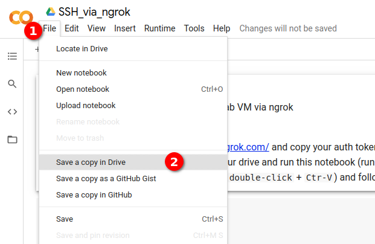

# How to get a Google Colab VM for free

Preprequisites:
* A google account
* A ngrok account (get a free account at https://ngrok.com/)
* A PC/laptop

## 1. Copy your ngrok auth token [here](https://dashboard.ngrok.com/auth)

After login, your token is an arbitrary series like

Alternatively, you can also look for the token from the suggested command

## 2. Clone 

## 3. Run the cloned notebook

## 4. Paste the auth token copied from [ngrok](https://dashboard.ngrok.com/auth)

Paste the token and press `Enter/Return` key.

## 5. Follow the output message after execution

If you are free ngrok user, as current term of use, you are limited to only one free tunnel. In case of unexpected error message, you should check as guided.

To check if there is any tunnel in use, go to [ngrok tunnel status page](https://dashboard.ngrok.com/status/tunnels). If the tunnel is active, tt would look similarly as below.

This might be the case when you have another Colab notebook session in operation. In order to use this tunnel again, you have to terminate this session, which means you would lose connection to this running Colab VM. You can manage Colab session by clicking on the arrow_shaped button and selecting `Manage sessions`

To solve this situation, the easiest way is to create another account, so that you have a new auth token and a new free tunnel. Otherwise, you should have known which device is using the tunnel, and manage to stop the device before you can use the tunnel again.

## 6. Connect to Colab VM

If things are fine, you are now able to connect to VM. As mentioned in the term of use, Colab VM can be active as much as 12 hour. So make sure you download everything before the VM is automatically stopped.

## 7. Just in case of accidental termination of Colab VM

If there are running tasks on Colab VM, the VM shuts down much earlier than expected due to human inactivity for a while. You can try the following way to simulate human behavior as if someone actually clicks to the `Reconnect` button every 60 seconds.

